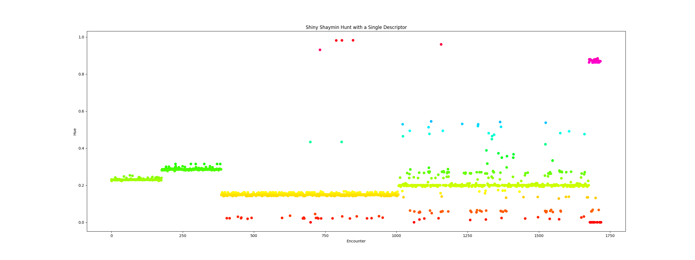

# Build
No build, just run the python scripts.

# Usage
## Setup
- Setup OBS with Switch on a given screen

# TODO
- Record video with my setup so I don't have to explain or forget it

# Detecting shinies methodology

Since the daytime can change the shiny color, we need an intelligent way of
determining if something is shiny. We can get all the non-shiny colors just by
doing a pick during each time of the day. This will get us a bound which we can
say anything within this bound is non-shiny if and only if the shiny color for
any given time of day does not fall within this bound.

If we utilize the median value in this bound for the recording, we can
determine a maximum allowed variance from this value.

To ensure a shiny will successfully be picked from this max bound, find a
source which displays both shiny and non-shiny variants and check the variance
of the two colors. If this exceeds the max variance, a shiny will likely be
chosen correctly.

The goal is minimize the maximum allowed variance. If the maximum allowed
variance is large then the timing delay to make the final shiny pick may be
swayed enough to the point where the wrong color is picked from the screen.
This will likely lead to false positive. If this is the case, the shiny hunt
should only take place during the daytime cycle (10:00-19:59).

# Shaymin hunt
- Set time to 10:00
- Execute first
- Then turn on the switch macro


# Imperical variance analysis
Variance bounds:
```
$ cli variance '#fff' '#fff'
0
$ cli variance '#fff' '#000'
195075
```

By picking the tuft above Shaymin's forehead vs its shiny:
```
$ cli pick --cformat hex
Click to pick a color
position=(1757, 1933)
color=#b0da76

$ cli pick --cformat hex
Click to pick a color
position=(2016, 1930)
color=#71d9c3

$ cli variance '#b0da76' '#71d9c3'
9899
```

By picking a slightly different spot on the same non-shiny shaymin...
```
$ cli pick --cformat hex
Click to pick a color
position=(1747, 1926)
color=#bee880

$ cli variance '#b0da76' '#bee880'
492
```

By picking the flower on shaymin:
```
$ cli pick --cformat hex
Click to pick a color
position=(1813, 1936)
color=#c5707a

$ cli pick --cformat hex
Click to pick a color
position=(2072, 1938)
color=#b2665b

$ cli variance '#c5707a' '#b2665b'
1422
```

Picking Darkrai's left shoulder
```

$ cli pick --cformat hex
Click to pick a color
position=(1792, 1934)
color=#434647

$ cli pick --cformat hex
Click to pick a color
position=(2056, 1934)
color=#312a43

$ cli variance '#434647' '#312a43'
1124
```

Picking  Darkrai's chin(?)
```
$ cli pick --cformat hex
Click to pick a color
position=(1747, 1943)
color=#841822

$ cli pick --cformat hex
Click to pick a color
position=(2008, 1943)
color=#812955
$ cli variance '#841822' '#812955'
2899
```

So basically, the variance may need to be adapted based on the Pokemon, but a
threshold of 1000 may be a good default. This seems to change wildly depending
on the pokemon. Perhaps there's better metric... hue?

# Shiny Shaymin with One Descriptor

## Results

### Plot



### Data

[Data](./assets/shaymin-one-descriptor/data.json). The hues in the data are
from printing every shiny pick during the hunt in RGB format, [see raw
data](./assets/shaymin-one-descriptor/stdout.raw). I then converted that to HLS
using `colorsys`. The hue values were kept from this result to plot.

### Descriptor

Descriptor used can be found [here](./assets/shaymin-one-descriptor/descriptor.json).

### Introspection

This was from an early version which used RGB euclidean distance for shiny
detection on Shaymin.

Due to light changes, whatever is macroing needs to maintain the time of day
which the descriptor applies, or more than one descriptor needs to be executed
against.

